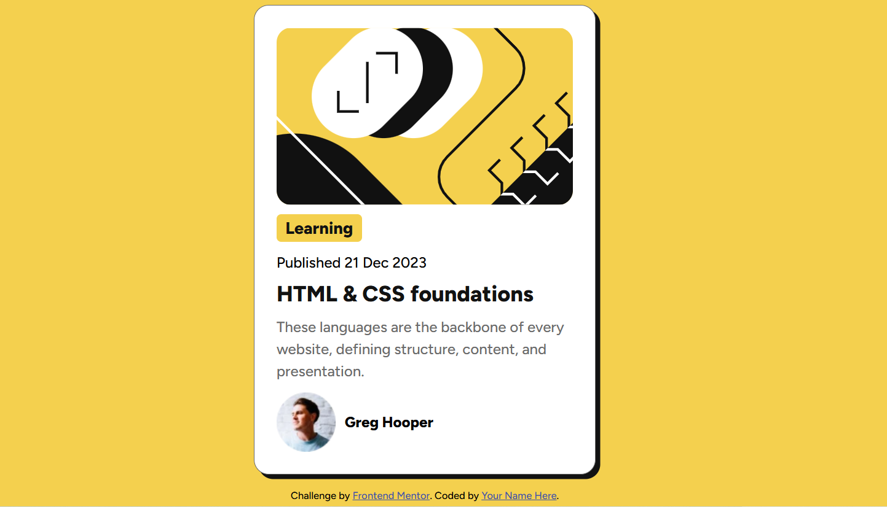

# Frontend Mentor - Blog preview card solution

This is a solution to the [Blog preview card challenge on Frontend Mentor](https://www.frontendmentor.io/challenges/blog-preview-card-ckPaj01IcS). Frontend Mentor challenges help you improve your coding skills by building realistic projects. 

## Table of contents

- [Overview](#overview)
  - [The challenge](#the-challenge)
  - [Screenshot](#screenshot)
  - [Links](#links)
- [My process](#my-process)
  - [Built with](#built-with)
  - [What I learned](#what-i-learned)
  - [Continued development](#continued-development)
  - [Useful resources](#useful-resources)
  - [AI Collaboration](#ai-collaboration)
- [Author](#author)
- [Acknowledgments](#acknowledgments)

**Note: Delete this note and update the table of contents based on what sections you keep.**

## Overview

### The challenge

This project is a responsive blog preview card component that displays an article preview with author information. The challenge involves building a visually appealing card that showcases blog article details in an elegant and interactive way.

Users should be able to:

- View a blog preview card with article title, category, publication date, and description
- See the author's avatar and name displayed
- Experience hover states on interactive elements for better user feedback
- Access the card on different screen sizes with a responsive design

### Screenshot



### Links

- Solution URL: [Add solution URL here](https://your-solution-url.com)
- Live Site URL: [Add live site URL here](https://your-live-site-url.com)

## My process

### Built with

- Semantic HTML5 markup
- CSS custom properties
- Flexbox


### What I learned

Through this project, I discovered important concepts about how elements behave in different layout contexts. Specifically, I learned that when a `span` element is placed inside a flex container, it behaves like a block-level element. To maintain its normal inline behavior and achieve the desired layout, I discovered CSS properties that control how elements are displayed. This taught me the importance of understanding display properties and how they interact with layout systems like Flexbox.

Example of the HTML structure:
```html
<div class="carte">
  <div class="carte-blog">
    <span class="carte-titre2">Learning</span>
    <h1 class="carte-titre1">HTML & CSS foundations</h1>
  </div>
</div>
```

Example of the CSS properties I used to solve this:
```css
display: flex;
flex-direction: column;
```

And for the span element specifically:
```css
border-radius: 5px;
display: inline-block;
width: fit-content;
align-self: flex-start;
```

By using `display: inline-block`, I was able to bring the span back to its normal behavior, and `align-self: flex-start` allowed me to control its alignment within the flex container.

### Continued development

In future projects, I want to focus on:

- **CSS Grid**: I want to deepen my understanding of CSS Grid layouts and how to combine them effectively with Flexbox for more complex page structures
- **JavaScript Projects**: I want to create interactive projects that incorporate JavaScript functionality, such as dynamic content manipulation, form validation, and event handling

These skills will help me build more robust and interactive web applications.

### Useful resources

### AI Collaboration

During this project, I used **GitHub Copilot** to help me with code suggestions and problem-solving. Specifically, GitHub Copilot helped me discover the behavior of `span` elements within flex containers. When I was struggling with how the span was behaving inside the flex container, Copilot suggested CSS properties like `display: inline-block` and `align-self: flex-start` that ultimately led me to understand and solve the problem.

**What worked well:**
- Copilot's intelligent code suggestions helped me explore different CSS approaches
- It introduced me to CSS properties I wasn't immediately thinking of
- The suggestions sparked my understanding of how flex containers affect child elements

This collaboration with AI significantly accelerated my learning process on this project.

## Author

## Acknowledgments

I would like to thank **Frontend Mentor** for providing this excellent challenge. It helped me practice and improve my skills in HTML, CSS, and understanding layout systems like Flexbox. The detailed design specifications and real-world project structure made this a valuable learning experience.
