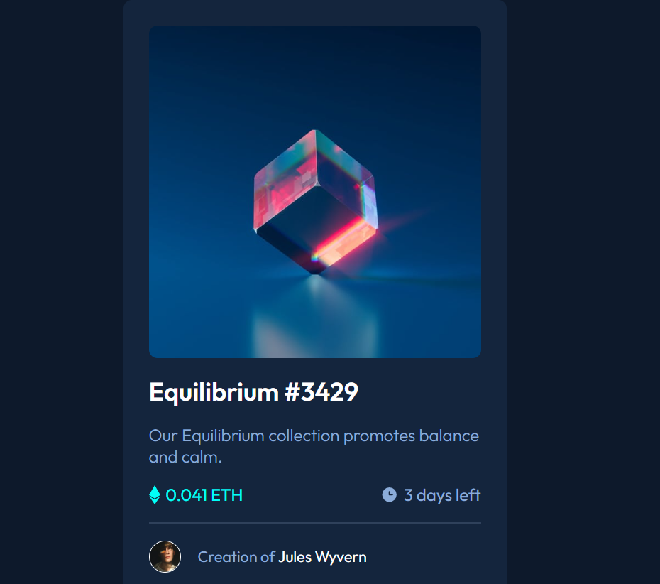

# Frontend Mentor - NFT preview card component solution

This is a solution to the [NFT preview card component challenge on Frontend Mentor](https://www.frontendmentor.io/challenges/nft-preview-card-component-SbdUL_w0U). Frontend Mentor challenges help you improve your coding skills by building realistic projects. 

## Table of contents

- [Overview](#overview)
  - [The challenge](#the-challenge)
  - [Screenshot](#screenshot)
  - [Links](#links)
- [My process](#my-process)
  - [Built with](#built-with)
  - [What I learned](#what-i-learned)
  - [Continued development](#continued-development)
  - [Useful resources](#useful-resources)
- [Author](#author)
- [Acknowledgments](#acknowledgments)

**Note: Delete this note and update the table of contents based on what sections you keep.**

## Overview

### The challenge

Users should be able to:

- View the optimal layout depending on their device's screen size
- See hover states for interactive elements

### Screenshot



### Links

- Solution URL: [Add solution URL here](https://your-solution-url.com)
- Live Site URL: [Add live site URL here](https://your-live-site-url.com)

## My process

### Built with

- Semantic HTML5 markup
- CSS custom properties
- Flexbox

### What I learned
The challenge allowed me to discover the `::after` property in CSS.
```css
.image-wrapper:hover::after {
    content: '';
    position: absolute;
    top: 0;
    left: 0;
    width: 100%;
    height: 100%;
    background-color: hsl(178, 100%, 50% , 0.4);
    background-image: url('./images/icon-view.svg');
    background-position: center;
    background-size: 50px;
    background-repeat: no-repeat;
    border-radius: 0.5rem;
    /* opacity: 0.4; */
}
```

### Continued development
I want to work on the CSS grid property, and also on JavaScript.

### Useful resources
## Author
- Frontend Mentor - [@ blaisehoungue327-rgb
](https://www.frontendmentor.io/blaise327/@ blaisehoungue327-rgb
)

## Acknowledgments
I thank Front-End for the challenge.
