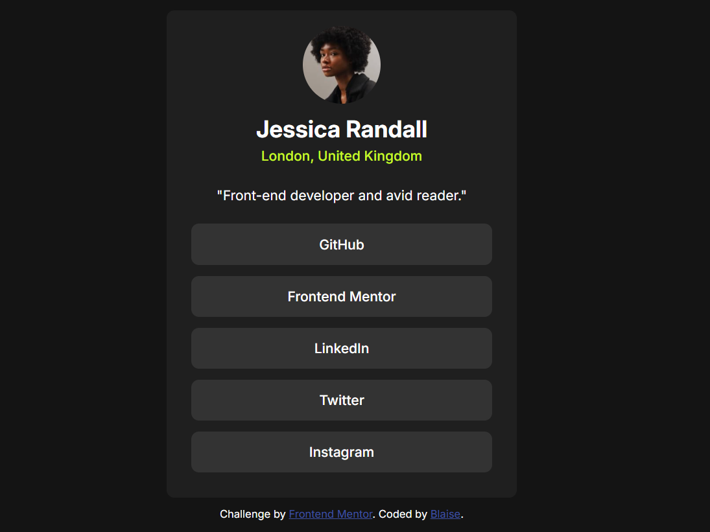

# Frontend Mentor - Social links profile solution

This is a solution to the [Social links profile challenge on Frontend Mentor](https://www.frontendmentor.io/challenges/social-links-profile-UG32l9m6dQ). Frontend Mentor challenges help you improve your coding skills by building realistic projects. 

## Table of contents

- [Overview](#overview)
  - [The challenge](#the-challenge)
  - [Screenshot](#screenshot)
  - [Links](#links)
- [My process](#my-process)
  - [Built with](#built-with)
  - [What I learned](#what-i-learned)
  - [Continued development](#continued-development)
  - [Useful resources](#useful-resources)
  - [AI Collaboration](#ai-collaboration)
- [Author](#author)
- [Acknowledgments](#acknowledgments)
## Overview

### The challenge

Create a profile with Jessica Randall's information and social links, with a responsive design and hover effects on the links.

### Screenshot



### Links

- Solution URL: [social-links-profile-main/social-links-profile-main](https://github.com/blaisehoungue327-rgb/Defis/tree/main/social-links-profile-main/social-links-profile-main)
- Live Site URL: [Add live site URL here](https://your-live-site-url.com)

## My process

### Built with

- Semantic HTML5 markup
- CSS custom properties
- Flexbox
- CSS Grid
### What I learned

I learned how to center and resize an image. I also learned how to use `object-fit: cover` and `object-position: center` to correctly display the image inside its circular container.

```css
.avatar {
  object-fit: cover;
  object-position: center;
}
```

### Continued development

In future projects, I want to learn more about CSS Grid, especially the `display: grid` property, to create more complex layouts.

### Useful resources

### AI Collaboration

I discovered the CSS properties `object-fit` and `object-position` through GitHub Copilot.

## Author

- Blaise

## Acknowledgments

Thanks to Frontend Mentor for providing this challenge and helping me practice HTML and CSS.
